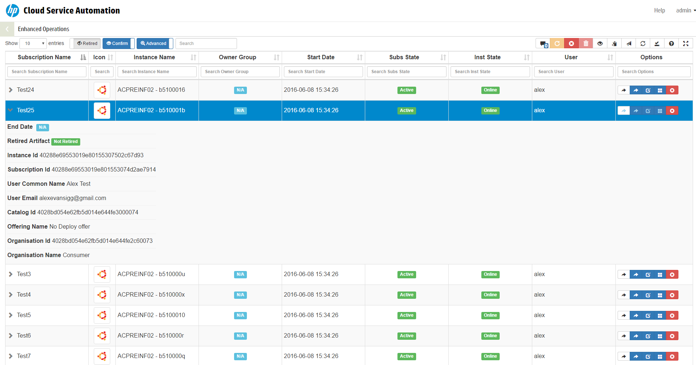

#  CSA Operations Enhanced

---
####  Current Version 0.06
----

This plugin allows a *Super Admin* to manage Subscriptions across multiple users and organisations efficiently. [See Here](http://alexevansigg.github.io/CSA-Enhanced-Operations)




The following features are exposed in this plugin with the aim of enhancing the CSA Operations experience

- __Global (Greedy) field filter__ – Single Search field across all exposed columns.
- __Individual Field Search filters__ - (e.g when you need to filter on a specific columns only)
- __Sorting__ on any field.
- __Individual Cancel/Delete/Resume Subscriptions__ - without the annoying drill down into the subscriptions
- __Modify Subscription Page Link__ - Requires Consumer Admin Session opened in MPP in advance.
- __Service Instance Page Link__ - Requires Consumer Admin Session opened in MPP in advance.
- Direct link to __Service Topology View__
- Direct Link to *standard* __Operations tab Overview__
- __Export__ Filtered Subscriptions to __Clipboard__ (tab separated) or as __Excel__
- Optionally Expose _Design bespoke Properties__ from Service Component Model (e.g. IP Address of NIC components or Hostnames of Server Components)
- __Display Retired Subscriptions__ - Subs that have been deleted from CSA and no longer visible in the *standard* operations console
- A local cache of the individual user preferences for configuration of the tool.
- Fullscreen mode - For utilising more screen space.


---
#### CSA Compatability Matrix
---

|CSA Version|Database|CEO Tested|
|-------|---------|-------|
| 4.2x | MSSQL | Yes |
| 4.2x | ORACLE | Yes |
| 4.2x | POSTGRES | Yes |
| 4.5x | MSSQL | Yes
| 4.5x | ORACLE | Yes |
| 4.5x | POSTGRES | Yes |
| 4.6 | MSSQL | Yes
| 4.6 | ORACLE | Yes |
| 4.6 | POSTGRES | Yes |
| 4.7x | ? | ? |

---
#### Installation Instructions
---

1. Create the folder custom-content (if it doesnt allready exist) in directory **<csahome>/jboss-as/standalone/csa.war**
2. Extract the Plugin contents into the custom-content folder, observe the correct folder structure in the custom-content folder as below:

 File Contents / Folder Structure

 + CSA-Enhanced-Operations/assets/css/bootstrap-toggle.css
 + CSA-Enhanced-Operations/assets/css/bootstrap-toggle.min.css
 + CSA-Enhanced-Operations/assets/css/bootstrap.min.css
 + CSA-Enhanced-Operations/assets/css/dataTables.combined.css
 + CSA-Enhanced-Operations/assets/css/dataTables.combined.min.css
 + CSA-Enhanced-Operations/assets/fonts/glyphicons.*
 + CSA-Enhanced-Operations/assets/js/bootstrap-toggle.js
 + CSA-Enhanced-Operations/assets/js/bootstrap-toggle.min.js
 + CSA-Enhanced-Operations/assets/js/bootstrap.min.js
 + CSA-Enhanced-Operations/assets/js/dataTables.combined.js
 + CSA-Enhanced-Operations/assets/js/dataTables.combined.min.js
 + CSA-Enhanced-Operations/assets/js/jquery.js
 + CSA-Enhanced-Operations/assets/js/jquery.min.js
 + CSA-Enhanced-Operations/css/CSA-Enhanced-Operations.css
 + CSA-Enhanced-Operations/js/CSA-Enhanced-Operations.js
 + CSA-Enhanced-Operations/pages/getSubs.jsp
 + CSA-Enhanced-Operations/pages/action.jsp
 + CSA-Enhanced-Operations/index.jsp 						
 + CSA-Enhanced-Operations/README.md
 + CSA-Enhanced-Operations/setup.json

3. Add the corresponsding entry to the csa.war/dashboard/config.json depending on the installed csa version.
  (inside main.tiles array or in sub panel see **Configuration guide** if unsure how to manipulate this file)
  
  **CSA 4.2**
  ```JSON
  	{
  		"id": "CSA-Enhanced-Operations",
  		"name": "CSA-Enhanced-Operations",
  		"description": "CSA-Enhanced-Operations_description",
  		"enabled": true,
  		"style": "custom-tile-header",
  		"target": "iframe",
  		"data": "/csa/custom-content/CSA-Enhanced-Operations/",
  		"helptopic": "console_help",
  		"roles": ["CSA_ADMIN"]
  	}
  ```
  **CSA 4.6**
  ```JSON 
  	{
  		"id": "CSA-Enhanced-Operations",
  		"name": "CSA-Enhanced-Operations",
  		"description": "CSA-Enhanced-Operations_description",
  		"enabled": true,
  		"style": "custom-tile-header",
  		"type": "iframe",
  		"url": "/csa/custom-content/CSA-Enhanced-Operations/",
  		"helptopic": "console_help",
  		"roles": ["CSA_ADMIN"]
  	}
  ```

4. Open the file csa.war/dashboard/messages/common/messages.properties and location section entitled:
  ```
  # Page titles and descriptions, used for the dashboard tiles and for navigation views
  ```
  Add the following entries

  ```JSON
  	CSA-Enhanced-Operations=Enhanced Operations
  	CSA-Enhanced-Operations_description=This experimental feature allows a Super User to
  	Manage Subscriptions across all organizations efficiently (Experimental)
  ```

5. To fix the CSA styling on the dashboard you can add the following css snippet to the end of the file **csa.war/dashboard/css/base.css** to make the Tile Title fit better.

  ```CSS
  	.tile h3 {
  		white-space:inherit;
  		font-size:1.4em;
  	}
  ```

6. Configure the settings in csa.war/custom-content/CSA-Enhanced-Operations/setup.json

	Name | Description  | Default
	------------- | ------------- |-------------
	MPP_HOST 					| The url of a MPP instance, Required for Consumer Admin Links  | https://localhost:8089/
	DATA_URL 					| The path to the URL for retrieving the Subscriptions          | pages/getSubs.jsp
	ENABLE_CONSUMER_ADMIN_LINKS | Set as false to disable direct links to Manage Subscriptions as Consumer Admin | true
	ENABLE_CANCEL_LINKS 		| Set as false to disable Cancel subscription functionality  | true
	ENABLE_RESUME_LINKS			| Set as false to disable resuming paused subscription functionality | true
	ENABLE_DELETE_LINKS			| Set as false to disable deleting offline subscription functionality | true
	REQUIRE_CONFIRMATION		| Set as false to determine the default behaviour regarding confirmation prompts | true
	SHOW_RETIRED				| Choose weather to include retired artifacts by default | false
	USE_FIXED_HEADER			| Set as false to disable the fixed header behaviour | true
  CACHE_NAME            | The name of the http cookie used for storing user preferences | CSA-E-O-Conf
	CONFIG_CACHE				| Integer representing the number of days end user configuration remain in browser cache | 5
  DEFAULT_DISPLAY_LENGTH    | Set the Default number of rows should be displayed, possible values 10,25,50 or ALL | 25
	SEARCH_TERM					| The default value set in the Datatables search field | "<Empty String>"
  ADVANCED_SEARCH   | The default setting for the individual column search field | true
	COLUMNS						| An object array of columns show in the datatable, the order here is the default order the columns show in, the titles represent the column headers, the data values should not be changed, add/remove the call "none" to move the column into the child row (drill down). | 


7. Update user partial path located on line 16 of the index.jsp depending on csa version. 

  **CSA 4.2**
  ```javascript
  <%@include file="/components/pages/partials/user.jsp" %>
  ```

   **CSA 4.5+**
  ```javascript
  <%@include file="/html-lib/pages/partials/user.jsp" %>
  ```
